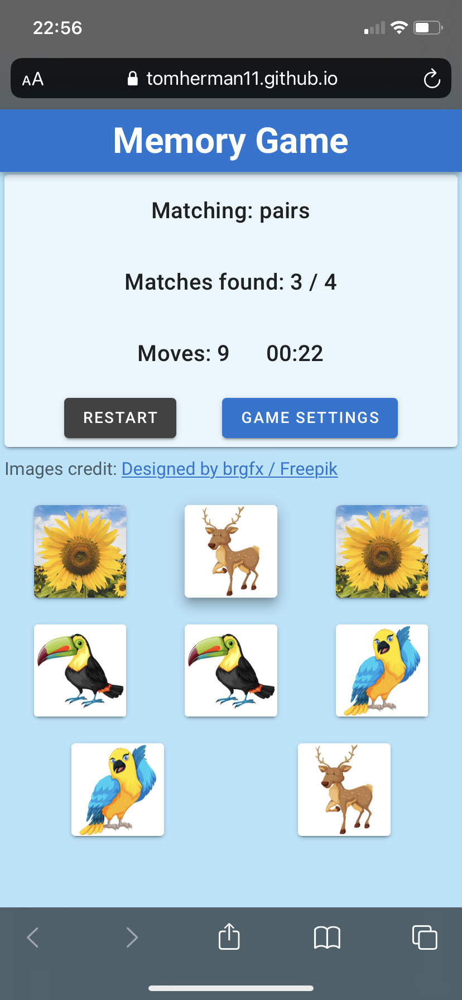
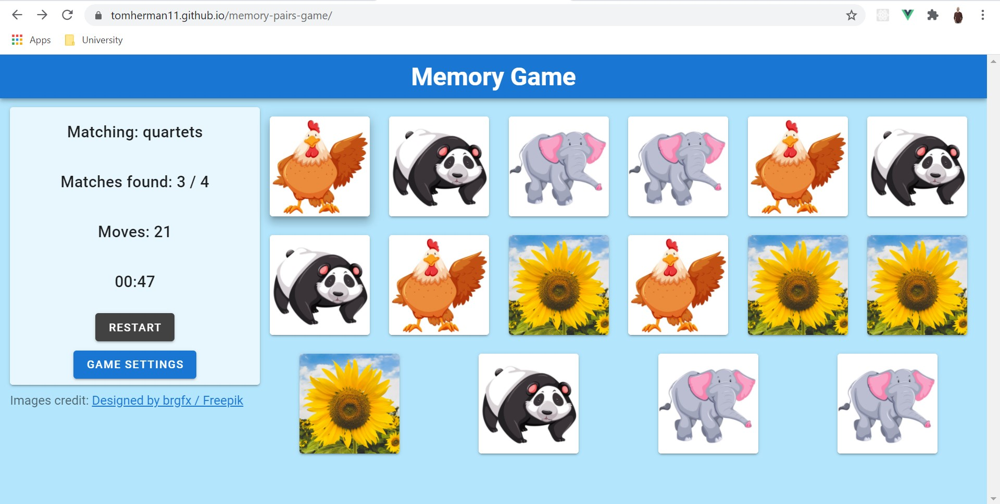

# memory-pairs-game
The classic favorite **Memory Game** with adorable animals. 🐘🐘🦜🦜 Match pairs, triplets and even quartets!

This project was made as part of my objective to improve my Vue.js skills.

[Vuetify](https://vuetifyjs.com/) is used in this project in order to enhance the UI, and indeed its contributaion is noticeable.

## Live Application:
Deployed at: [https://tomherman11.github.io/memory-pairs-game/](https://tomherman11.github.io/memory-pairs-game/)

The application supports landscape & portrait modes:

## Development
- Created with vue-cli 4.5.9.
- Run locally by running `npm run serve`.
- Build a production version with `npm run build`.
- See [how to deploy a Vue.js project to Github pages](https://cli.vuejs.org/guide/deployment.html#github-pages)

